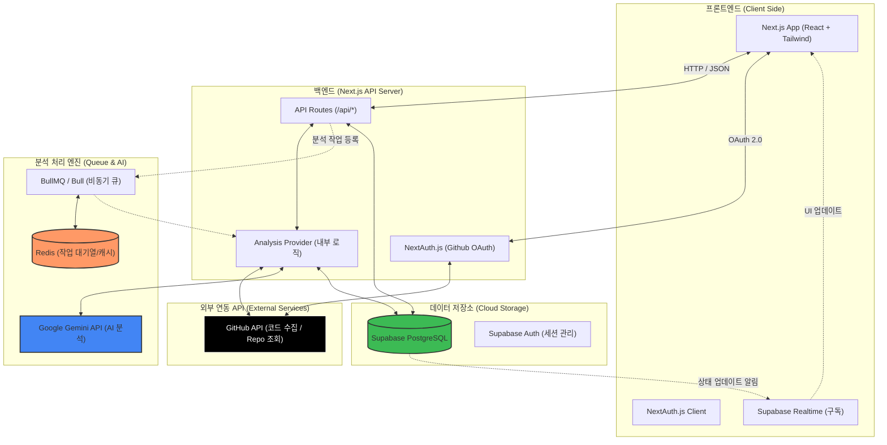

# Logling 시스템 아키텍처 (System Architecture)

Logling의 전체적인 데이터 흐름과 구성 요소 간의 연결 구조입니다.

---

## 🛰️ 주요 서비스 통신 흐름 설명 (Data Cycle)

### 1. 사용자 인증 및 저장소 동기화
- 사용자가 GitHub 계정으로 로그인하면 **NextAuth**가 GitHub API로부터 액세스 토큰을 발급받습니다.
- **Next.js BE**는 이 토큰을 사용하여 사용자의 저장소 목록을 조회하고, **Supabase DB**에 레포지토리 정보를 캐싱합니다.

### 2. 커밋 분석 (퀘스트 수락) 요청
- 사용자가 특정 커밋에 대해 [분석] 버튼을 누르면, **Next.js BE**는 즉시 분석 ID를 생성하고 **Redis/BullMQ** 작업 대기열에 임무를 등록합니다.
- 사용자는 화면에서 '분석 대기 중' 상태를 보며 대기합니다.

### 3. 비동기 AI 분석 프로세스
- **Worker (Analysis Provider)**가 대기열에서 작업을 가져와 **GitHub API**로부터 코드 차이점(Git Diff)을 수집합니다.
- 수집된 코드는 민감 정보 마스킹 처리를 거친 후 **Gemini AI API**로 전달되어 분석 결과(JSON)를 도출합니다.
- 도출된 결과는 **Supabase DB**에 저장되며, 이때 사용자의 **경험치(XP)**가 함께 정산됩니다.

### 4. 실시간 상태 확인 및 결과 도달
- 분석이 완료되어 DB 레코드가 업데이트되면, **Supabase Realtime** 기능을 통해 프론트엔드로 즉시 알림이 전송됩니다.
- 사용자 화면이 '완료' 상태로 실시간 업데이트되며, 분석된 데이터가 화면에 출력됩니다.