# Logling 데이터베이스 ERD (관계도)

Logling 프로젝트의 핵심 데이터 구조와 테이블 간의 관계입니다. 모든 데이터는 **Supabase (PostgreSQL)** 인스턴스에서 관리됩니다.

```mermaid
erDiagram
    USER_PROFILES ||--o{ REPOSITORIES : "사용자 소유 저장소"
    USER_PROFILES ||--o{ ANALYSES : "요청한 분석 내역"
    USER_PROFILES ||--o{ TECH_SKILLS : "보유 기술 숙련도"
    REPOSITORIES ||--o{ ANALYSES : "저장소별 분석 기록"

    USER_PROFILES {
        uuid id PK "사용자 고유 ID (GitHub ID 기반 UUID)"
        text github_username "깃허브 아이디 (Unique Index)"
        text nickname "화면 표시 닉네임"
        text avatar_url "프로필 이미지 주소"
        int level "현재 레벨 (기본값 1)"
        bigint xp "누적 총 경험치"
        enum mascot_personality "마스코트 성격 (witty, professional, aggressive)"
        boolean public_profile "프로필 공개 여부"
        boolean telemetry_sharing "데이터 공유 동의 여부"
        timestamptz created_at "생성 일시"
        timestamptz updated_at "수정 일시 (Trigger 활성화)"
    }

    REPOSITORIES {
        uuid id PK "고유 ID"
        uuid user_id FK "소유자 ID (FK 인덱스 적용)"
        bigint github_repo_id "깃허브 내부 고유 ID (Unique Index)"
        text full_name "저장소 경로명 (Owner/Repo)"
        text description "저장소 설명 (Optional)"
        text language "주요 프로그래밍 언어"
        int stargazers_count "스타 수"
        int forks_count "포크 수"
        timestamptz updated_at "데이터 동기화 시점"
    }

    ANALYSES {
        uuid id PK "고유 ID"
        uuid user_id FK "분석 요청 유저 (Index 적용)"
        uuid repository_id FK "대상 저장소 (Index 적용)"
        text commit_sha "커밋 해시 (Index 적용)"
        text commit_message "사용자 커밋 메시지 원본"
        enum status "상태 (pending, processing, completed, failed)"
        int impact_score "AI 분석 영향력 점수 (0-100)"
        int xp_awarded "지급된 총 경험치 수치"
        jsonb ai_result "Gemini AI 분석 상세 JSON 결과물"
        text error_message "실패 시 디버깅용 메시지"
        timestamptz completed_at "분석 완료 시각"
        timestamptz created_at "생성 시각 (정렬 인덱스 적용)"
    }

    TECH_SKILLS {
        uuid id PK "고유 ID"
        uuid user_id FK "유저 ID (Unique 복합키 일부)"
        text name "기술 명칭 (Unique 복합키 일부 - 예: React, Java)"
        int level "해당 기술 레벨"
        bigint xp "해당 기술 전용 경험치"
        timestamptz updated_at "숙련도 업데이트 시점"
    }
```

---

## 🛠️ 주요 데이터베이스 최적화 정보 (인덱스 전략)

### 1. 고유 인덱스 (Unique Indices)
- **`user_profiles.github_username`**: 유저 중복 가입 방지 및 이름 검색 최적화.
- **`repositories.github_repo_id`**: 깃허브 API 데이터와의 1:1 매칭 무결성 보장.
- **`tech_skills (user_id, name)`**: 한 유저가 같은 기술 이름을 중복해서 가지지 않도록 복합 유니크 인덱스 적용.

### 2. 성능 최적화 인덱스 (Performance Indices)
- **`analyses (user_id, created_at DESC)`**: 대시보드 및 아카이브(도감)에서 유효한 분석 내역을 최신순으로 빠르게 조회하기 위한 복합 인덱스.
- **`analyses (commit_sha)`**: 특정 커밋이 이미 분석되었는지 빠르게 캐시 검사하기 위해 사용.
- **`repositories (user_id)`**: 특정 사용자의 전체 프로젝트 목록을 가져오는 속도 향상.

### 3. 트리거 및 자동화 (Triggers)
- **`update_updated_at_column`**: `user_profiles` 테이블 수정 시 자동으로 `updated_at` 시각을 갱신하는 트리거가 활성화되어 있습니다.
- **`awardXP` 로직 (Supabase RPC/Application)**: 분석 결과가 `completed`로 변경될 때 유저 프로필과 기술 스택의 경험치를 동시에 갱신하는 원자적(Atomic) 연산을 수행합니다.
